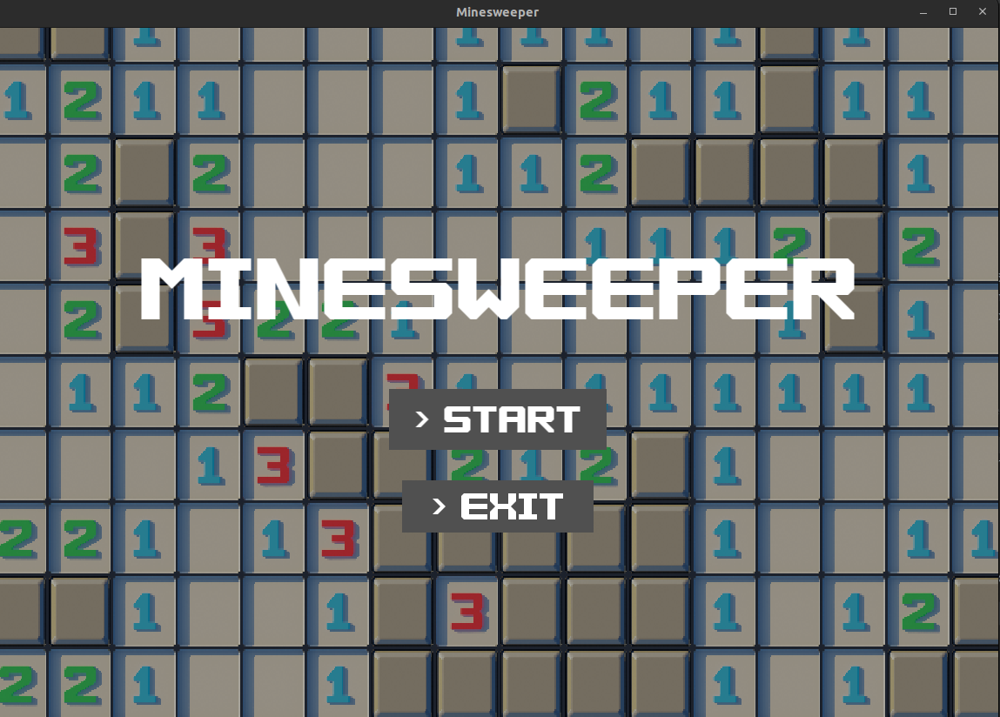
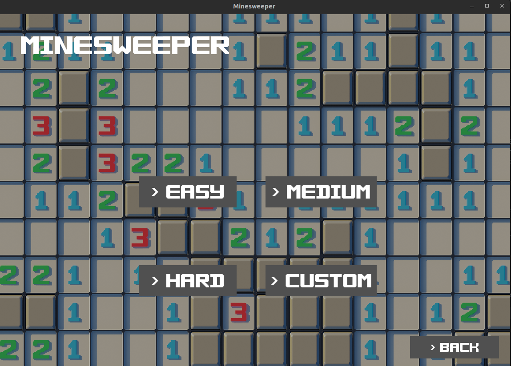
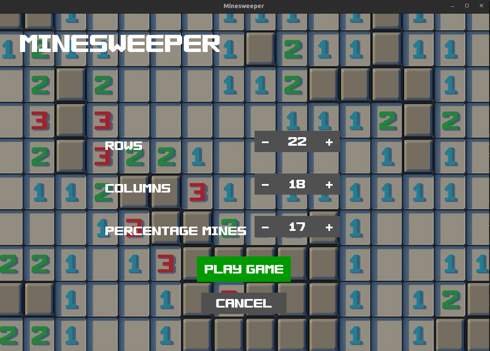
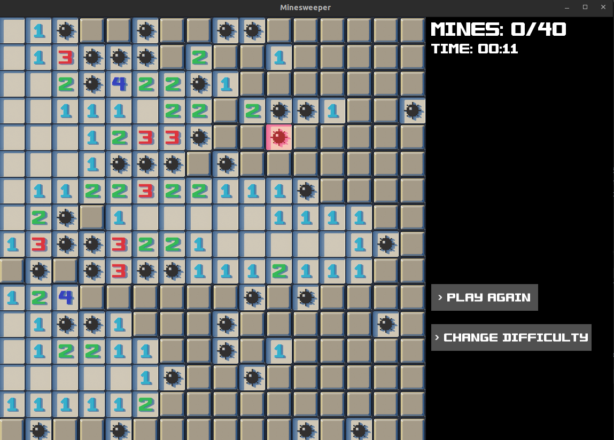

# Minesweeper
Project goal was to remake popular Minesweeper game using SFML Graphics library.


## Compilation info
In order to compile the project you have to have SFML installed beforehand. Depending on the OS you're using you can to this by typing:
### Linux
```shell
sudo apt-get update
sudo apt-get install libsfml-dev
```
### macOS
On macOS I recommend using brew to install SFML. Here you can check how to install `brew` on your device: [https://brew.sh/](https://brew.sh/)
```shell
brew install sfml
```

If you have SFML installed on your computer, it should be able to find it under this path:
* Linux:    `/usr/include/SFML`
* macOS:    `/opt/homebrew/Cellar/sfml/2.5.1_2/include`


Makefile was created to work on both **Linux** and **macOS**, automatically detecting operating system. So if you have installed everything properly, all you have to do now is to run this command in terminal in your workspace folder
```shell
mkdir build
make all
```

After the compilation program can be run by this command
```shell
./build/minewsweeper
```
## Used libraries
Minesweeper utilizes SFML Graphics library for textures rendering and user input.

## Project architecture and modules
Whole project was designed taking into account Object Oriented Programming principles as well as some design patters such as Factory design pattern.

Project consists of following modules and classes
1. **Logic Module**
    * `Board`
    * `Cell`
    * `Exceptions`
2. **Interface Module**
   * `UI namespace with widgets' classes`
   * `GuiManager`
3. **States Module**
    * `Abstact class State`
    * `Menu`
    * `GameState`
    * `BoardSelectState`
    * `CustomBoardState`

## Gameplay
Minesweeper offers 4 types of gameplay:
1. Easy with board dimensions 8x8 and 10 mines
2. Medium with board dimensions 16x16 and 40 mines
3. Hard with board dimensions 16x30 and 99 mines



4. Custom board size where user can specify each board dimension from 4 to 40 and set percentage of board covered by mines varying from 1% to 40%.


### Rules
The game is won when user flags all mines in the board and all remaining board fields are uncovered.

User can uncover field using `MouseLeft button` and flag field using `MouseRight button`. Moreover if user is uncertain whether field contains mine or not, he can mark field as unknown using `MouseRight button` on already flagged cell.



## Credits
Textures and font made by Gangetsha Lyx, licensed under CC BY-SA 3.0